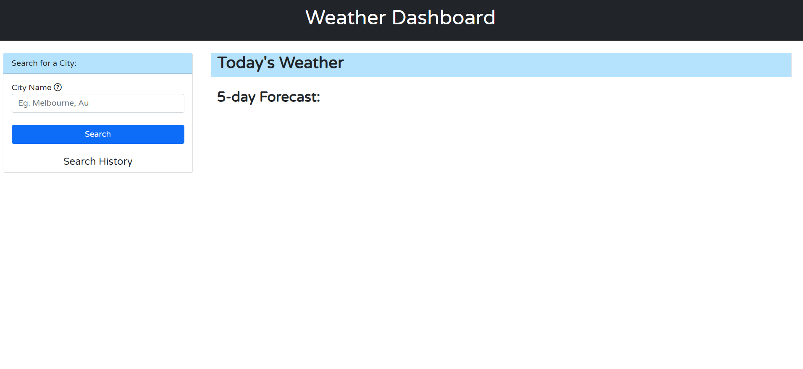
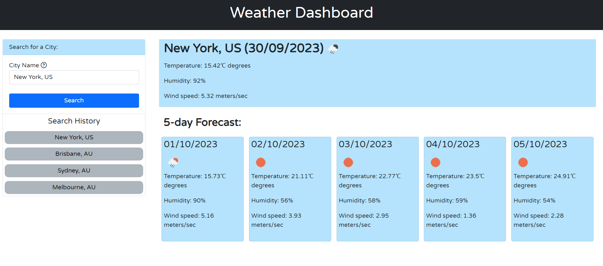

# weather-dashboard
A weather forecast dashboard web page that utilizes weather data provided by openweathermap.org's API.

## Description

The page allows users to enter the name of a city and search for it's current weather information. The dashboard page also returns a 5 day forecast details provided by openweathermap.org.

If there are multiple cities with the name, the user can also enter the ISO country code eg. Melbourne, AU after the city name to provide more accurate and specific results. If no country code is provided, then the dashboard will default to first city provided by openweathermap.org's Geocoding API. For example searching for "Mealbourne" will default to Melbourne in US.

The search history is recorded in user's local storage and only stores a maximum of 8 records. The search result should list the more recent search at the top and older search at the bottom. See screenshots attached below.

## Dependencies

* Open in a browser such as Google Chrome, Firefox or Edge etc.

## Installation

* Open url link https://amethystlyre.github.io/Weather-dashboard/ in above mention browsers.

## Credits
N/A

## Version History
N/A

## License

This project is licensed under the MIT License - see the LICENSE.md file for details